<div align="center">

# 🏔️ Watershed Morphometric Analysis

[](https://python.org)
[](https://colab.research.google.com/github/YOUR_USERNAME/morphometric-watershed-analysis/blob/main/MASTER_RUNNER.ipynb)
[](LICENSE)
[]()
[]()
[]()
[]()

[](https://doi.org/10.5281/zenodo.XXXXXXX)
[]()
[]()
[]()
[](https://github.com/YOUR_USERNAME/morphometric-watershed-analysis/actions)

**A publication-grade, fully reproducible watershed morphometric analysis pipeline**  
*Horton (1945) · Strahler (1952, 1964) · Schumm (1956) · Miller (1953) · El Hamdouni (2008) · Perron & Royden (2012)*

---

**➡️  [Upload your data](#-quick-start) → Push to GitHub → Maps & tables auto-generate in 5 minutes**

</div>

---

## 📋 Table of Contents

| | |
|---|---|
| [🚀 Quick Start](#-quick-start) | [📦 Repository Structure](#-repository-structure) |
| [🗺️ Workflow Diagram](#️-workflow-diagram) | [📐 Morphometric Parameters](#-morphometric-parameters) |
| [🔬 Section Guide](#-section-guide) | [🗺️ Sample Outputs](#️-sample-outputs) |
| [⚙️ GitHub Actions](#️-github-actions-auto-visualization) | [📚 References](#-references) |

---

## 🚀 Quick Start

### Step 1 — Upload your data

Place your files inside the `data/` folder:

```
data/
├── dem.tif                  ← Filled SRTM 30m DEM
├── subbasins.shp            ← 5-subbasin shapefile (+ .dbf .shx .prj)
├── streams.shp              ← Stream network (+ sidecars)
├── stream_order.shp         ← Strahler order attribute shapefile
├── flow_direction.tif       ← D8 flow direction raster
├── flow_accumulation.tif    ← D8 flow accumulation raster
└── pour_points.shp          ← Outlet pour points (optional but recommended)
```

> **Zip shortcut:** You can also drop a single `watershed_data.zip` — Section 0 auto-extracts and detects all layers.

### Step 2 — Push to GitHub

```bash
git add data/
git commit -m "feat: upload watershed data"
git push origin main
```

**GitHub Actions fires automatically.** In ~5–10 minutes:
- All 25+ maps are generated and committed to `outputs/previews/`
- This README updates with live image embeds below
- CSV tables appear in `outputs/tables/`

### Step 3 — Or run locally / in Colab

```bash
# Local
pip install -r requirements.txt
python MASTER_RUNNER.py

# Colab — open the badge link above, upload your zip, run all cells
```

---

## 📦 Repository Structure

```
morphometric-watershed-analysis/
│
├── 📄 README.md                        ← You are here
├── 📄 MASTER_RUNNER.py                 ← Runs all sections in sequence
├── 📄 requirements.txt
├── 📄 .gitignore
│
├── 📁 data/                            ← ⬅️  DROP YOUR FILES HERE
│   ├── .gitkeep
│   └── README.md
│
├── 📁 .github/
│   └── workflows/
│       ├── auto_visualize.yml          ← Auto-runs on data push
│       └── validate_data.yml           ← Validates CRS & file integrity
│
├── 📁 sections/                        ← One folder per section
│   ├── S0_extract/                     ← ZIP extraction & file discovery
│   ├── S1_environment/                 ← Library setup
│   ├── S2_preprocessing/               ← CRS · Reproject · Snap pour pts
│   ├── S3_morphometry/                 ← Linear · Areal · Relief params
│   ├── S4_maps/                        ← 9 publication maps
│   ├── S5_statistics/                  ← Stats · PCA · Clustering
│   ├── S6_prioritization/              ← 3-method ranking
│   ├── S7_plotly/                      ← 12 interactive charts
│   ├── S8_S9_export/                   ← Tables · Report
│   ├── S10_tectonic/                   ← IAT · AF · Vf · Smf
│   ├── S11_steepness/                  ← ksn · χ-plot · SL index
│   ├── S12_anomaly/                    ← GAI · Lineaments · SI
│   └── S13_flood/                      ← TWI · SPI · STI · FFPI
│
├── 📁 outputs/                         ← Auto-generated (do not edit)
│   ├── previews/                       ← PNG maps (GitHub-visible)
│   ├── tables/                         ← CSV morphometric tables
│   ├── html/                           ← Plotly interactive charts
│   ├── shapefiles/                     ← Priority & lineament shapefiles
│   └── report/                         ← Auto-generated text report
│
└── 📁 docs/
    ├── morphometric_workflow_drawio.xml ← draw.io flowchart
    └── theory_reference.md             ← Parameter formulae & citations
```

---

## 🗺️ Workflow Diagram

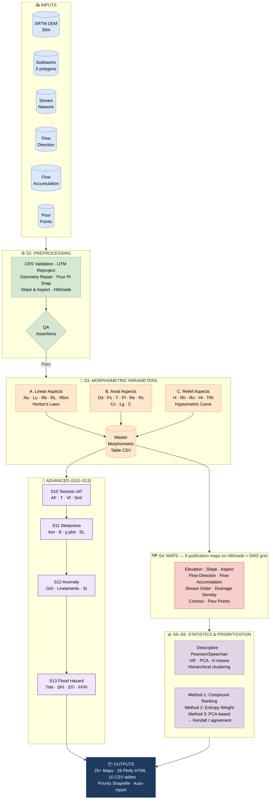

---

## 📐 Morphometric Parameters

<details>
<summary><b>A. Linear Aspects</b> — click to expand</summary>

| Symbol | Parameter | Formula | Reference |
|--------|-----------|---------|-----------|
| Nu | Stream Number | Count per order | Horton (1945) |
| Lu | Stream Length | Σ segment lengths | Horton (1945) |
| Lsm | Mean Stream Length | Lu / Nu | Strahler (1964) |
| RL | Stream Length Ratio | Lsm(u) / Lsm(u−1) | Horton (1945) |
| Rb | Bifurcation Ratio | Nu / Nu+1 | Strahler (1952) |
| Rbm | Mean Bifurcation Ratio | Mean of all Rb | Strahler (1957) |
| wRbm | Weighted Mean Rb | Σ(Rb × weight) / Σweight | Strahler (1957) |

</details>

<details>
<summary><b>B. Areal Aspects</b> — click to expand</summary>

| Symbol | Parameter | Formula | Reference |
|--------|-----------|---------|-----------|
| Dd | Drainage Density | ΣL / A (km/km²) | Horton (1945) |
| Fs | Stream Frequency | N / A (streams/km²) | Horton (1945) |
| T | Texture Ratio | N / P | Smith (1950) |
| Ff | Form Factor | A / Lb² | Horton (1932) |
| Re | Elongation Ratio | (2/Lb)√(A/π) | Schumm (1956) |
| Rc | Circularity Ratio | 4πA / P² | Miller (1953) |
| Cc | Compactness Coeff | P / (2√πA) | Gravelius (1914) |
| Lg | Length Overland Flow | 1 / 2Dd | Horton (1945) |
| C | Channel Maintenance | 1 / Dd | Schumm (1956) |

</details>

<details>
<summary><b>C. Relief Aspects</b> — click to expand</summary>

| Symbol | Parameter | Formula | Reference |
|--------|-----------|---------|-----------|
| H | Basin Relief | Hmax − Hmin (m) | Hadley & Schumm (1961) |
| Rh | Relief Ratio | H / Lb | Schumm (1956) |
| Rn | Ruggedness Number | H × Dd | Strahler (1958) |
| MRN | Melton Ruggedness | H / √A | Melton (1965) |
| HI | Hypsometric Integral | (Hmean − Hmin) / H | Strahler (1952) |
| TRI | Terrain Ruggedness | √Σ(xi − x0)² | Riley et al. (1999) |

</details>

<details>
<summary><b>D. Advanced — Tectonic, Steepness, Hazard</b> — click to expand</summary>

| Symbol | Parameter | Formula | Reference |
|--------|-----------|---------|-----------|
| AF | Asymmetry Factor | 100 × Ar/At | El Hamdouni et al. (2008) |
| T | Transverse Symmetry | Da / Dd | Cox (1994) |
| Vf | Valley Floor Ratio | 2Vfw / [(Eld−Esc)+(Erd−Esc)] | Bull & McFadden (1977) |
| Smf | Mountain Front Sin. | Lmf / Ls | Bull & McFadden (1977) |
| IAT | Active Tectonics Index | Mean(AF+T+Vf+Smf scores) | El Hamdouni et al. (2008) |
| SL | SL Gradient Index | (ΔH/ΔL) × L | Hack (1973) |
| θ | Concavity Index | −slope of log S vs log A | Flint (1974) |
| ksn | Steepness Index | S × A^θref (θref=0.45) | Wobus et al. (2006) |
| χ | Chi Coordinate | ∫(A₀/A)^m dx | Perron & Royden (2012) |
| TWI | Topographic Wetness | ln(A / tan β) | Beven & Kirkby (1979) |
| SPI | Stream Power Index | A × tan β | Moore et al. (1991) |
| STI | Sediment Transport | (A/22.13)^0.6×(sinβ/0.0896)^1.3 | Moore & Burch (1986) |
| FFPI | Flash Flood Potential | Slope×0.35+Relief×0.25+TWI×0.25+SPI×0.15 | Smith (2003) |

</details>

---

## 🔬 Section Guide

Each section is **independent and debuggable**. Click a section for its full README.

| Section | Name | Key Outputs | Status |
|---------|------|-------------|--------|
| [S0](sections/S0_extract/) | ZIP Extraction & File Discovery | Auto-detected layer paths | ✅ Ready |
| [S1](sections/S1_environment/) | Environment & Libraries | Installed packages | ✅ Ready |
| [S2](sections/S2_preprocessing/) | Data Loading & Preprocessing | UTM-reprojected layers, snapped pour pts | ✅ Ready |
| [S3](sections/S3_morphometry/) | Morphometric Parameters | `morphometric_master_table.csv` | ✅ Ready |
| [S4](sections/S4_maps/) | Publication Maps (9) | PNG maps with DMS grid + hillshade | ✅ Ready |
| [S5](sections/S5_statistics/) | Statistical Analysis | Correlation, PCA, clustering | ✅ Ready |
| [S6](sections/S6_prioritization/) | Watershed Prioritization | 3-method ranking + Kendall τ | ✅ Ready |
| [S7](sections/S7_plotly/) | Plotly Visualizations (12) | Interactive HTML charts | ✅ Ready |
| [S8–S9](sections/S8_S9_export/) | Export & Report | All CSVs + text report | ✅ Ready |
| [S10](sections/S10_tectonic/) | Tectonic Activity Indices | IAT map, radar chart | ✅ Ready |
| [S11](sections/S11_steepness/) | Channel Steepness & χ-plot | ksn map, chi-elevation, SA plot | ✅ Ready |
| [S12](sections/S12_anomaly/) | Geomorphic Anomaly | GAI map, lineament shapefile | ✅ Ready |
| [S13](sections/S13_flood/) | Flood Hazard Indicators | TWI/SPI/STI/FFPI maps, FHI ranking | ✅ Ready |

---

## 🗺️ Sample Outputs

> **These images auto-update when you push data files via GitHub Actions.**  
> After your first push, replace the placeholder paths below with your actual output filenames — or let the Actions workflow patch them automatically.

### Core Morphometric Maps

| Elevation | Slope | Stream Order |
|:---------:|:-----:|:------------:|
| 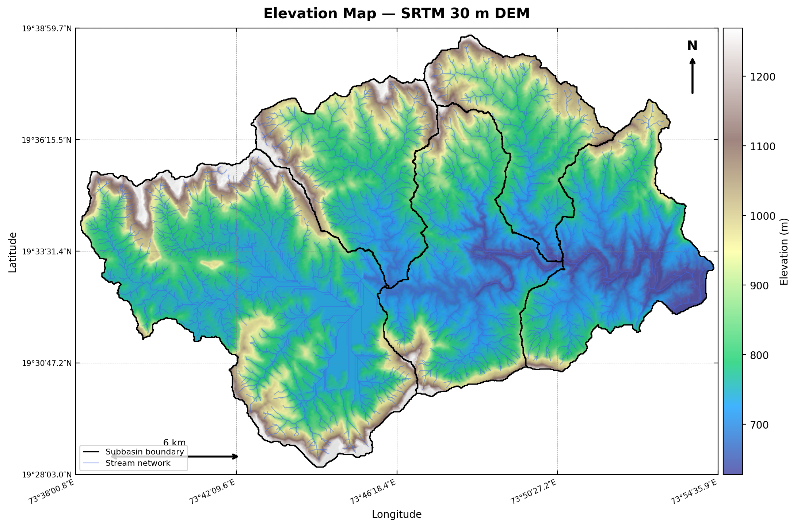 | 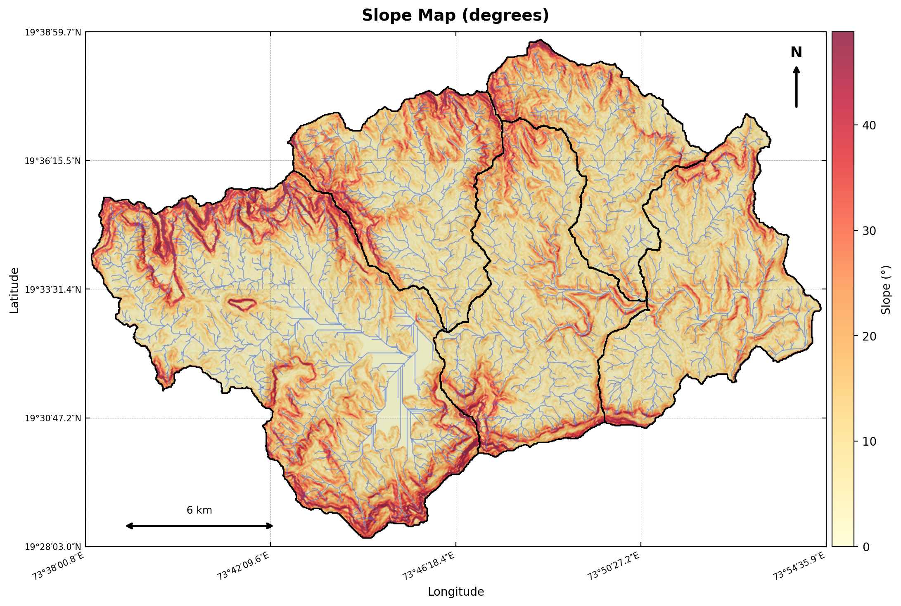 | 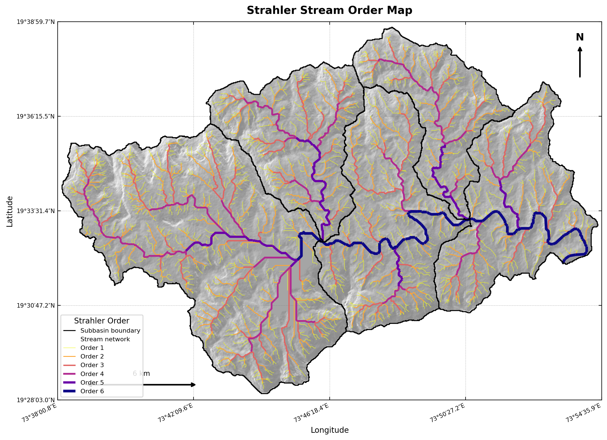 |

| Flow Accumulation | Drainage Density | Contour |
|:-----------------:|:----------------:|:-------:|
| 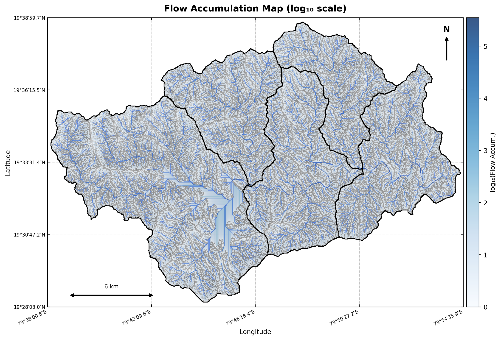 | 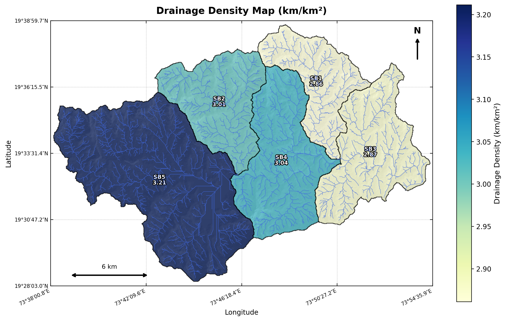 | 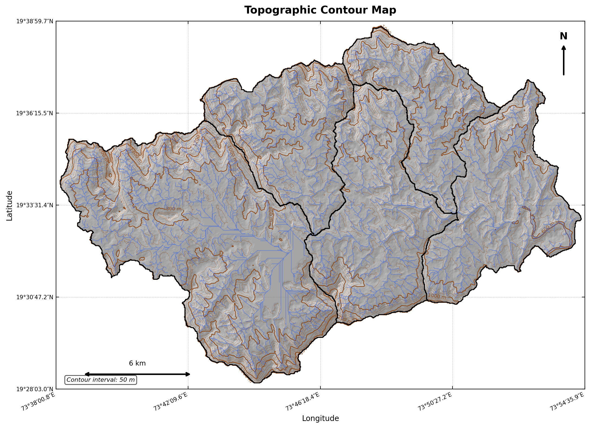 |

### Advanced Analysis Maps

| Tectonic IAT | SL Anomaly | GAI |
|:------------:|:----------:|:---:|
| 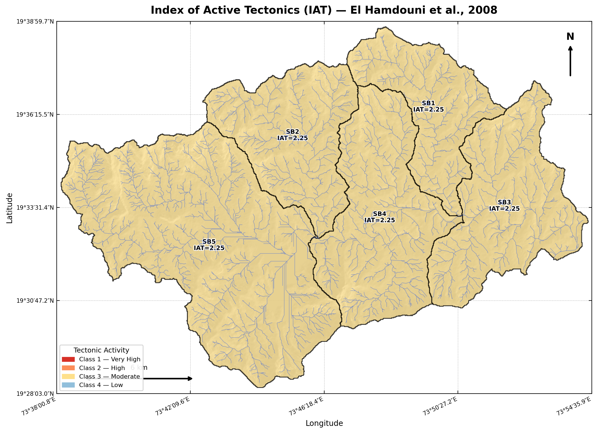 |  | 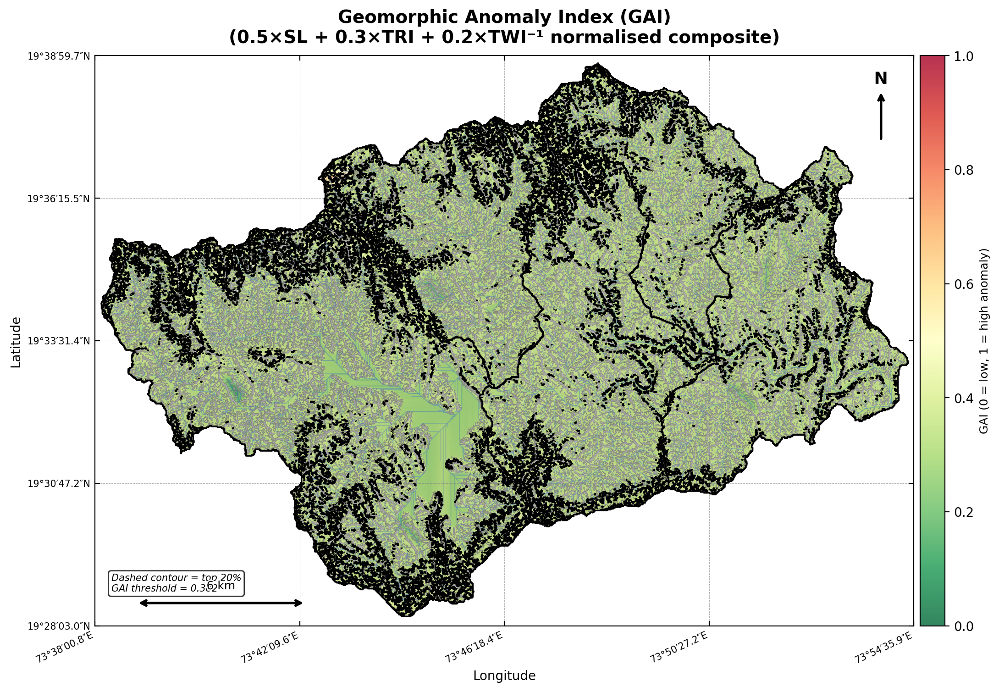 |

| TWI | FFPI | Flood Hazard |
|:---:|:----:|:------------:|
| 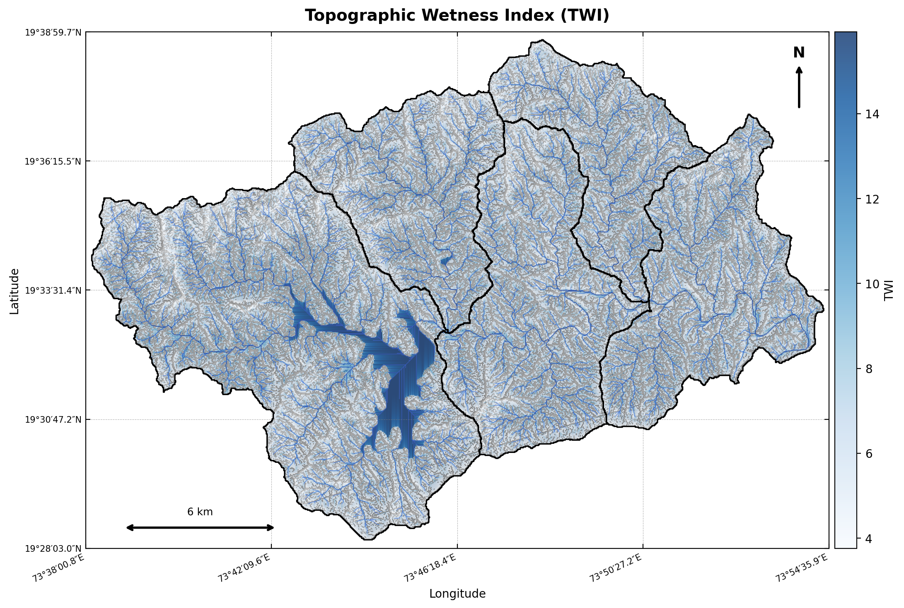 | 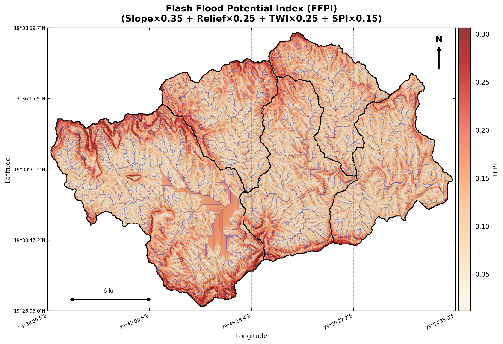 |  |

### Statistical Outputs

| PCA Biplot | Correlation Heatmap | Priority Ranking |
|:----------:|:-------------------:|:----------------:|
|  | 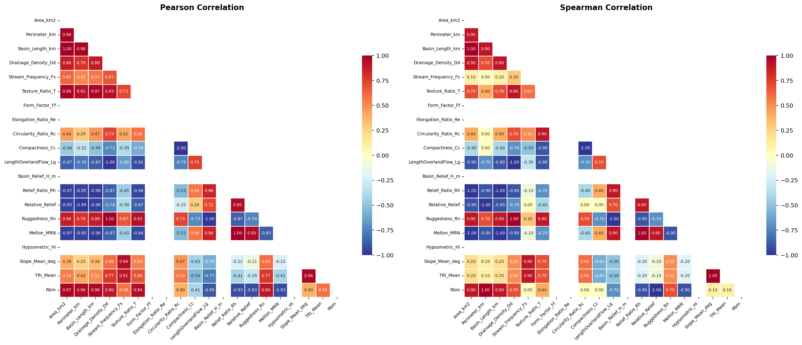 |  |

---

## ⚙️ GitHub Actions — Auto-Visualization

The pipeline runs **automatically** when you push files to `data/`.

```
Push data/ ──► validate_data.yml ──► auto_visualize.yml ──► outputs/previews/ committed back
                    │                       │
                    ▼                       ▼
              CRS check             All 25+ maps generated
              File integrity        All 10 CSV tables saved
              n_basins == 5         README image paths patched
```

**Workflow triggers:**
```yaml
on:
  push:
    paths:
      - 'data/**'          # fires when any file in data/ changes
  workflow_dispatch:       # manual trigger button in GitHub UI
```

To run manually: **Actions tab → Auto Visualize Watershed → Run workflow**

---

## 📊 Morphometric Results

> *Auto-generated after data upload — table below populates via GitHub Actions*

<!-- MORPHOMETRIC_TABLE_START -->
| Basin | Area (km²) | Dd (km/km²) | Re | Rc | HI | IAT Class | Flood Priority |
|-------|-----------|-------------|-----|-----|-----|-----------|----------------|
| SB1 | — | — | — | — | — | — | — |
| SB2 | — | — | — | — | — | — | — |
| SB3 | — | — | — | — | — | — | — |
| SB4 | — | — | — | — | — | — | — |
| SB5 | — | — | — | — | — | — | — |
<!-- MORPHOMETRIC_TABLE_END -->

---

## 📚 References

<details>
<summary>Click to expand full reference list</summary>

```
Beven, K.J. & Kirkby, M.J. (1979). A physically based, variable contributing area model
  of basin hydrology. Hydrological Sciences Bulletin, 24(1), 43–69.

Bull, W.B. & McFadden, L.D. (1977). Tectonic geomorphology north and south of the
  Garlock fault, California. Geomorphology in Arid Regions, 115–138.

Cox, R.T. (1994). Analysis of drainage basin symmetry as a rapid technique to identify
  areas of possible Quaternary tilt-block tectonics. Geology, 22(9), 813–816.

El Hamdouni, R., Irigaray, C., Fernández, T., Chacón, J. & Keller, E.A. (2008).
  Assessment of relative active tectonics, southeast Spain. Geomorphology, 96(1–2), 150–173.

Flint, J.J. (1974). Stream gradient as a function of order, magnitude, and discharge.
  Water Resources Research, 10(5), 969–973.

Gravelius, H. (1914). Grundriss der gesamten Gewässerkunde. Band 1: Flußkunde.
  Goschen, Berlin, Germany.

Hack, J.T. (1957). Studies of longitudinal stream profiles in Virginia and Maryland.
  USGS Professional Paper 294-B.

Hack, J.T. (1973). Stream-profile analysis and stream-gradient index. USGS Journal
  of Research, 1(4), 421–429.

Horton, R.E. (1932). Drainage basin characteristics. Transactions of the American
  Geophysical Union, 13, 350–361.

Horton, R.E. (1945). Erosional development of streams and their drainage basins.
  Geological Society of America Bulletin, 56(3), 275–370.

Melton, M.A. (1965). The geomorphic and palaeoclimatic significance of alluvial
  deposits in Southern Arizona. Journal of Geology, 73(1), 1–38.

Miller, V.C. (1953). A quantitative geomorphic study of drainage basin characteristics
  in the Clinch Mountain area, Virginia and Tennessee. Columbia University, ONR Tech. Rep.

Moore, I.D. & Burch, G.J. (1986). Sediment transport capacity of sheet and rill flow:
  Application of unit stream power theory. Water Resources Research, 22(13), 1350–1360.

Moore, I.D., Grayson, R.B. & Ladson, A.R. (1991). Digital terrain modelling: A review
  of hydrological, geomorphological and biological applications. Hydrological Processes,
  5(1), 3–30.

Perron, J.T. & Royden, L. (2012). An integral approach to bedrock river profile analysis.
  Earth Surface Processes and Landforms, 38(6), 570–576.

Riley, S.J., DeGloria, S.D. & Elliot, R. (1999). A terrain ruggedness index that
  quantifies topographic heterogeneity. Intermountain Journal of Sciences, 5, 23–27.

Schumm, S.A. (1956). Evolution of drainage systems and slopes in badlands at Perth
  Amboy, New Jersey. Geological Society of America Bulletin, 67(5), 597–646.

Smith, G.H. (1950). The morphometry of Ohio. Annals of the Association of American
  Geographers, 40(4), 288–304.

Smith, G.H. (2003). Flash flood potential index. NWS Training Document.

Strahler, A.N. (1952). Hypsometric (area-altitude) analysis of erosional topography.
  Geological Society of America Bulletin, 63(11), 1117–1142.

Strahler, A.N. (1957). Quantitative analysis of watershed geomorphology. Transactions
  of the American Geophysical Union, 38(6), 913–920.

Strahler, A.N. (1964). Quantitative geomorphology of drainage basins and channel
  networks. In Handbook of Applied Hydrology (ed. V.T. Chow), pp. 4.39–4.76.

Wobus, C., Whipple, K.X., Kirby, E., Snyder, N., Johnson, J., Spyropolou, K.,
  Crosby, B. & Sheehan, D. (2006). Tectonics from topography: Procedures, promise, and
  pitfalls. GSA Special Papers, 398, 55–74.
```

</details>

---

## 🧑‍💻 Contributing & Citation

If you use this pipeline in your research, please cite:

```bibtex
@software{morphometric_analysis_2025,
  author    = {Satwik K Udupi},
  title     = {Watershed Morphometric Analysis Pipeline},
  year      = {2026},
  publisher = {GitHub},
  url       = {https://github.com/Satwik-1234/morphometric-watershed-analysis},
  doi       = {10.5281/zenodo.XXXXXXX}
}
```

---

<div align="center">

Made with ❤️ for geomorphology research  
`Python` · `GeoPandas` · `Rasterio` · `Plotly` · `RichDEM` · `Scikit-learn`

</div>
