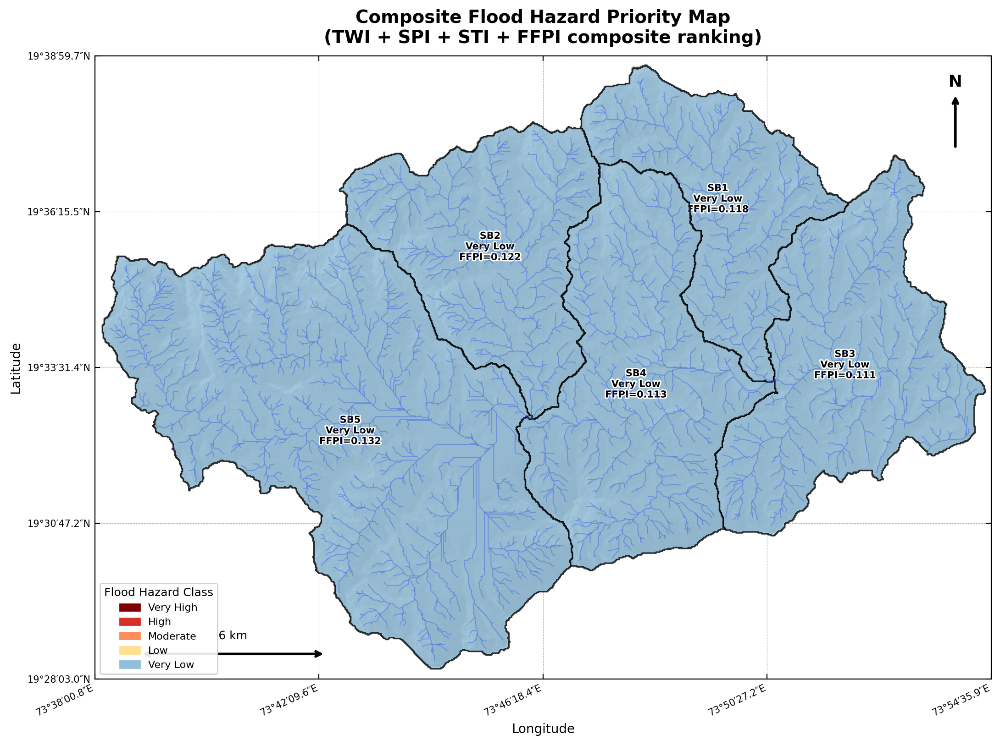

# S13 — Flood Hazard Indicators

> TWI, SPI, STI, and FFPI rasters. Composite Flood Hazard Index (FHI) per subbasin with priority ranking. 5 maps and 3 Plotly charts.

---

## Inputs
`SLOPE_ARR, FACC_ARR, DEM_ARR, local relief`

## Key outputs
`flood_hazard_indices.csv, 13a_TWI_map.png, 13b_SPI_map.png, 13c_STI_map.png, 13d_FFPI_map.png, 13e_flood_hazard_composite_map.png`

## Key functions
- `compute_TWI()`
- `compute_SPI()`
- `compute_STI()`
- `classify_ffpi()`

---

## How to run

```python
# In Colab — ensure previous sections are in memory
exec(open('sections/S13_flood/script.py').read())
```

## Output Preview



---

← [Back to main README](../../README.md)
