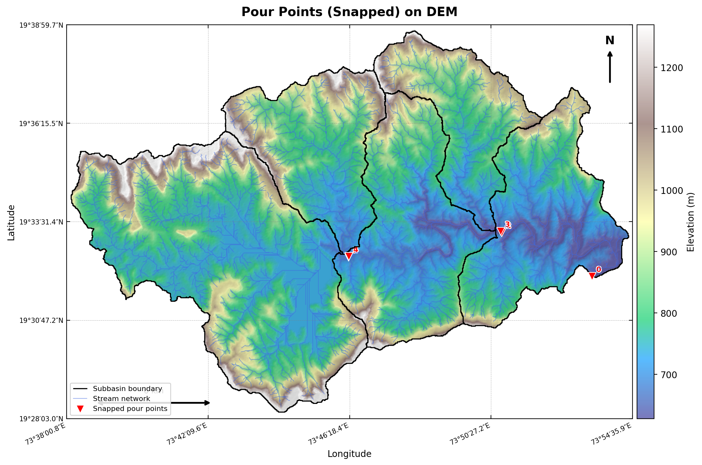

# S2 — Data Loading & Preprocessing

> Loads all GIS layers, validates CRS, reprojects to UTM, fixes geometries, snaps pour points to maximum flow accumulation, computes slope/aspect/hillshade.

---

## Inputs
`Raw DEM, subbasins.shp, streams.shp, flow_dir.tif, flow_acc.tif, pour_points.shp`

## Key outputs
`UTM-reprojected rasters, gdf_sub, gdf_streams, gdf_so, DEM_ARR, SLOPE_ARR, ASPECT_ARR, HILLSHADE`

## Key functions
- `detect_utm_epsg()`
- `reproject_raster()`
- `fix_geometries()`
- `snap_pour_points()`

---

## How to run

```python
# In Colab — ensure previous sections are in memory
exec(open('sections/S2_preprocessing/script.py').read())
```

## Output Preview



---

← [Back to main README](../../README.md)
