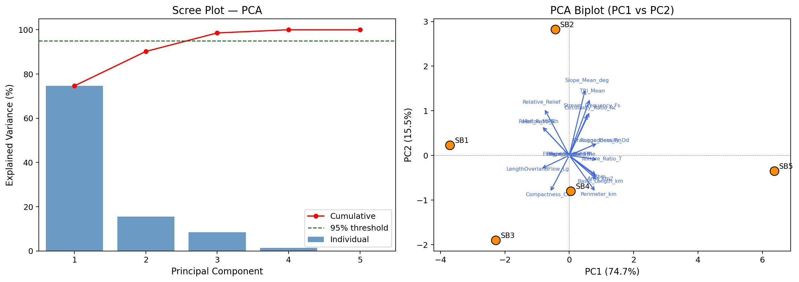

# S5 — Statistical Analysis

> Descriptive statistics, Pearson/Spearman correlation heatmaps, VIF, PCA (scree + biplot), K-means and hierarchical clustering.

---

## Inputs
`df_master (from S3)`

## Key outputs
`descriptive_statistics.csv, correlation_pearson.csv, pca_loadings.csv, pca_scree_biplot.png, kmeans_clusters.png, hierarchical_dendrogram.png`

## Key functions
- `PCA()`
- `KMeans()`
- `silhouette_score()`
- `variance_inflation_factor()`

---

## How to run

```python
# In Colab — ensure previous sections are in memory
exec(open('sections/S5_statistics/script.py').read())
```

## Output Preview



---

← [Back to main README](../../README.md)
