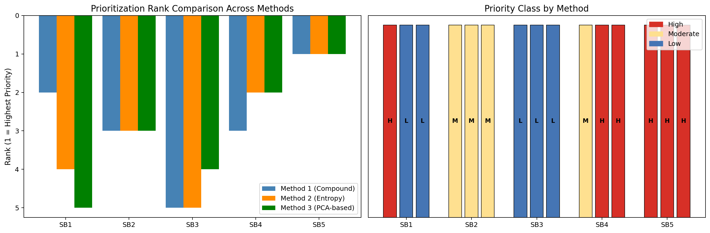

# S6 — Watershed Prioritization

> Three independent prioritization methods (Compound Ranking, Entropy Weight, PCA-based) with Kendall's τ inter-method agreement analysis.

---

## Inputs
`df_master (from S3)`

## Key outputs
`prioritization_ranking.csv, kendall_tau.csv, subbasins_priority.shp, prioritization_comparison.png`

## Key functions
- `entropy_weight_score()`
- `score_AF()`
- `iat_class()`
- `stats.kendalltau()`

---

## How to run

```python
# In Colab — ensure previous sections are in memory
exec(open('sections/S6_prioritization/script.py').read())
```

## Output Preview



---

← [Back to main README](../../README.md)
